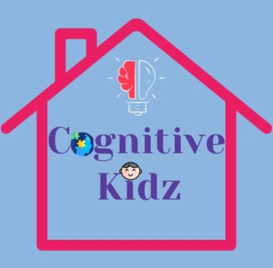
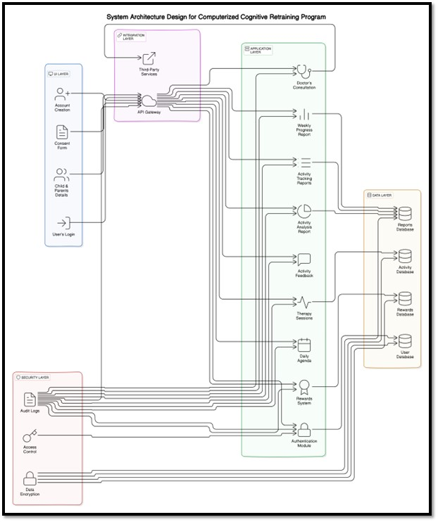
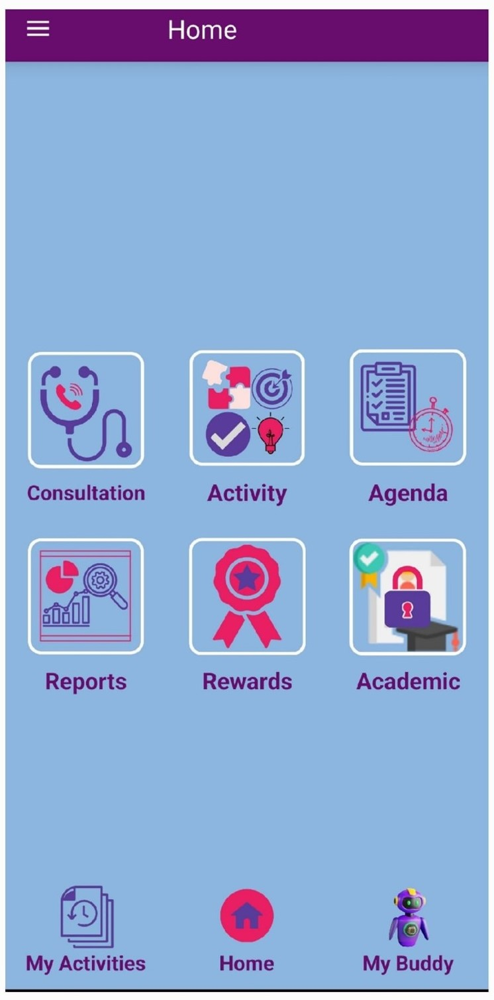
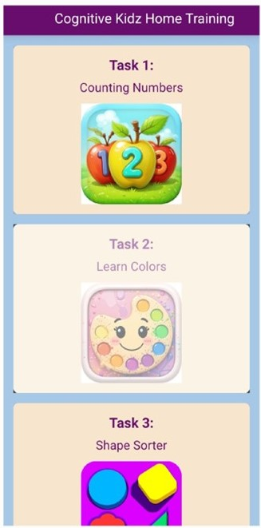
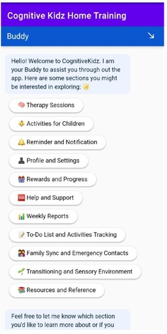

<p align="center">
  
</p>

<p align="center">
  
  
  
  
</p>

<h1 align="center">🧠 Cognitive Kidz Home Training App</h1>
<h3 align="center">Computerized Home Training Program for Children with Developmental Disabilities</h3>

<p align="center">
  <br>
  <em>Redefining cognitive therapy access for children with developmental disabilities — <br>bringing expert care home through smart technology.</em>
</p>

---

## 📲 Download the App

<p align="center">
  
  <br>
  <i>Scan QR to download CognitiveKidz Android App</i>
</p>

---

## 📘 Introduction

**CognitiveKidz** is a therapeutic mobile app developed for children aged **3–10 years** with **developmental disabilities** like Autism, ADHD, and intellectual delay. The app delivers engaging **game-based cognitive activities**, live **doctor consultations**, automated **progress tracking**, and personalized recommendations to promote child development at home.

---

## ❓ Problem Statement

Parents and caregivers of children with developmental disabilities often struggle to:

- Access quality therapy consistently  
- Afford regular sessions with pediatric specialists  
- Monitor and track developmental progress effectively  

**CognitiveKidz** addresses these challenges by offering a **digital, structured, and gamified solution** accessible from any Android device.

---

## 🎯 Project Goals

- Provide structured home-based therapy activities  
- Enable real-time doctor-child consultation  
- Track progress with detailed analytics and rewards  
- Support parents with interactive guides and reports  
- Improve cognitive skills via engaging game formats

---

## 👥 Target Users

| 👶 Children (3–10 yrs) | With Autism, ADHD, learning delays |
|------------------------|------------------------------------|
| 👨‍👩‍👧‍👦 Parents          | Monitor progress and train at home |
| 👩‍⚕️ Therapists          | Track growth, customize activities |
| 🧑‍⚕️ Pediatricians       | Conduct virtual therapy sessions   |

---

## 🚀 Core Features

- 🎮 **Cognitive Games** – Logic, memory, focus, decision-making  
- 🧩 **Reward System** – Trophies, badges, stickers, certificates  
- 📈 **Analytics** – Progress graphs, child-wise activity reports  
- 👩‍⚕️ **Doctor Dashboard** – Consultation & monitoring interface  
- 🤖 **AI Chatbot** – BuddyForKido for child guidance & feedback  
- 🔐 **Secure Login** – Separate portals for child & doctor

---

## 🧰 Tech Stack

| Component         | Technology Used                    |
|------------------|-------------------------------------|
| App Development   | Android Studio (Java)              |
| Backend/Database  | Firebase (Auth, Firestore)         |
| Games             | HTML5, CSS3, JavaScript (ES2022)   |
| Chatbot           | Google DialogFlow ES               |
| Reporting         | Matplotlib (Python - Backend Reports) |
| CI/CD             | GitHub, SSH-based integration      |

---

## 🧪 System Architecture

<p align="center">
  
</p>

---

## 📈 Results

<table align="center">
  <tr>
    <td align="center">
      <br>
      <sub><strong>🧒 Child Dashboard</strong><br>Engaging and colorful interface for children</sub>
    </td>
    <td align="center">
      <br>
      <sub><strong>👩‍⚕️ Doctor Dashboard</strong><br>View progress, consult, and assign therapies</sub>
    </td>
  </tr>
  <tr><td colspan="2"><br></td></tr>
  <tr>
    <td align="center">
      <br>
      <sub><strong>🎮 Cognitive Activities</strong><br>Memory, logic, pattern games for brain training</sub>
    </td>
    <td align="center">
      <br>
      <sub><strong>🤖 AI Chatbot – BuddyForKido</strong><br>Conversational assistant for child support</sub>
    </td>
  </tr>
</table>

---

## 📥 Installation Instructions

### 🔧 Clone the Repository

```bash
git clone git@github.com:CognoAppProject/CognitiveKidz.git
````

---

### 🔐 SSH Setup (First Time Users)

1. **Create SSH Key**

```bash
ssh-keygen -t rsa -b 4096 -C "cognitivekidzhometraining@gmail.com"
```

2. **View SSH Directory**

```bash
ls -l ~/.ssh/
```

3. **Configure SSH**

```bash
nano ~/.ssh/config
```

➡️ Add this:

```bash
Host github.com
  IdentityFile ~/.ssh/id_rsa_cogno
  User git
```

4. **Test Connection**

```bash
ssh -T git@github.com
```

✅ Should return:

> Hi \<user>! You've successfully authenticated...

---

## 🏆 Achievements

* 📱 Built a fully operational Android app with live chat & analytics
* 🧠 Designed 10+ interactive therapeutic activities
* 📊 Enabled real-time progress tracking and PDF report generation
* 💬 Implemented NLP-based chatbot for child guidance
* 👨‍👩‍👧 Empowered families to access therapy from home

---

## 🔮 Future Enhancements

* 🌍 Multilingual chatbot using advanced NLP
* 📢 Notification & alert system for activity reminders
* 💳 Secure payments for specialist consultations
* 📈 Cloud-based therapy analytics dashboard for institutions

---

## 📃 License

This work is for academic, demo and research purposes.
<br>
© 2025 CognitiveKidz | All rights reserved.

---

<p align="center">
  📄 <a href="assets/CognitiveKidz_Final_Report.pdf" target="_blank"><strong>View Project Report</strong></a>
</p>

---

<p align="center">
  <i>"Therapy becomes accessible when technology speaks the language of care."</i> 🌟
</p>

---
